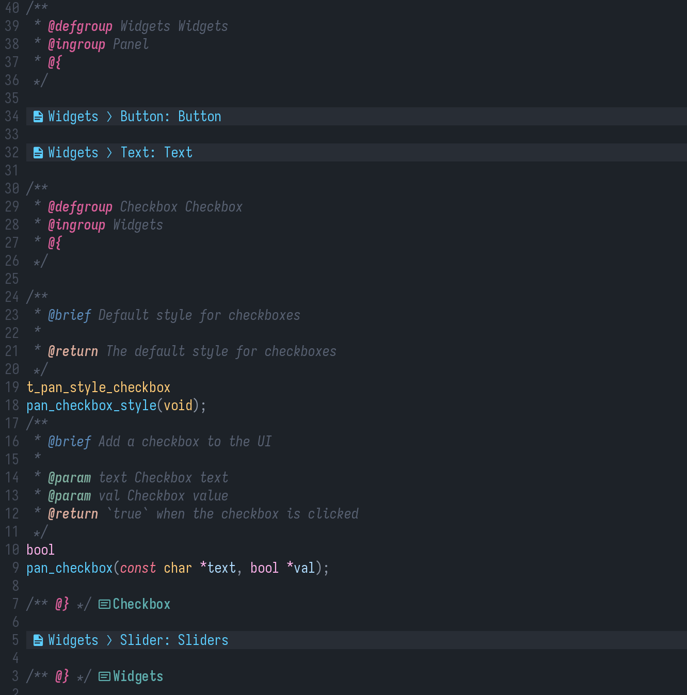

# Doxyvim: NeoVim + Doxygen = ♥️

Doxyvim provides highlights, completion and folds when working with doxygen.


**Doxyvim in action**

# Installation

Doxyvim requires treesitter to work. Treesitter comes preinstalled for modern NeoVim, but you still need to make sure parsers are installed for the languages you want to work with (e.g `TSInstall cpp`).

**lazy.nvim**:
```lua
{
    "ef3d0c3e/doxyvim",
    opts = {
        -- Your custom options
    },
},
```

# Features

## Fold

Doxyvim lets you fold Doxygen groups:
```c
/**
 * @defgroup MyGroup
 * @{
 */

// Anything here can be folded under 'MyGroup'

/** @} */
```

**Default configuration**
```lua
fold = {
    -- Toggle folding
    enable = true,
    -- Format for orphan group (no parent group)
    format_orphan = " 󰈙 %s: %s", -- (group.name, group.description)
    -- Format for groups with a parent
    format_child = " 󰈙 %s ❭ %s: %s", -- (parent.name, group.name, group.description)
    inlay_hints = { ... }
}
```

### Inlay hints

This feature toggles an indicator after a group's closing token (`/** @} */`) to display which group is being closed by the token.

**Default configuration**
```lua
fold = {
    ...
    inlay_hints = {
        -- Toggle hints
        enable = true,
        -- Hints highlight
        style = { fg = "#5fafaf", bold = true },
        -- Hints format, %s is the group's name
        format = "󰭸 %s",
    }
},
```

## Highlight

Doxyvim will highlight Doxygen tags. Highlights are granular and can be customized for each token.

**Default configuration**
```lua
highlight = {
    -- Toggle highlighting
    enable = true,
    -- Highlighter function: return a highlight group per Doxygen tag.
    -- highlights are created only once per tag and are cached afterwards.
    hl = function(tag)
        local regular = {
            ["brief"] = true,
            ["file"] = true,
            ["author"] = true,
            ["version"] = true,
            ["see"] = true,
            ["since"] = true,
            ["details"] = true,
            ["throws"] = true,
            ["exception"] = true,
            ["deprecated"] = true,
            ["example"] = true,
            ["test"] = true,
            ["def"] = true,
            ["typedef"] = true,
            ["var"] = true,
            ["struct"] = true,
            ["class"] = true,
            ["enum"] = true,
            ["interface"] = true,
            ["package"] = true,
            ["namespace"] = true,
            ["fn"] = true,
            ["name"] = true,
            ["code"] = true,
            ["endcode"] = true,
            ["sa"] = true,
            ["ref"] = true,
            ["link"] = true,
            ["endlink"] = true,
            ["copydoc"] = true,
            ["docRoot"] = true,
            ["inheritDoc"] = true,
            ["internal"] = true,
            ["invariant"] = true,
            ["mainpage"] = true,
            ["page"] = true,
            ["section"] = true,
            ["subsection"] = true,
            ["threadsafe"] = true,
            ["nosubgrouping"] = true,
            ["p"] = true,
        }
        if regular[tag] then
            return { fg = "#5f8fbf" }
        end

        local group = {
            ["{"] = true,
            ["}"] = true,
            ["ingroup"] = true,
            ["defgroup"] = true,
            ["addtogroup"] = true,
        }
        if group[tag] then
            return { fg = "#da5f9a", bold = true }
        end

        -- Functions
        if tag == "param" then
            return { fg = "#7faf9f", bold = true, italic = true }
        elseif tag == "return" then
            return { fg = "#dfaf9f", bold = true, italic = true }
        -- Special
        elseif tag == "note" then
            return { fg = "#5fafff", underline = true }
        elseif tag == "todo" then
            return { fg = "#5fafff", bold = true, underline = true }
        elseif tag == "warning" then
            return { fg = "#dfaf6f", bold = true, underline = true }
        elseif tag == "bug" then
            return { fg = "#ff7f6f", bold = true, underline = true }
        end
        return nil
    end
},
```

## Completion

Doxyvim supports Doxygen tag completion. Completions are triggered upoin entering `@` or `\\`

**NOTE**: This feature is still experimental and requires [blink.cmp](https://github.com/Saghen/blink.cmp).
You will need to change your blink.cmp setup to include the following:
```lua
-- In your `opts` add the following inside `sources`:
sources = {
    ...
    default = { 
        ... -- Your other sources, e.g 'lsp', 'path', 'buffer', etc.
        "doxyvim_source"
    },
    providers = {
        ...
        -- Doxyvim completion provider
        doxyvim_source = {
            name = "Doxyvim",
            module = "doxyvim.blink_source",
        },
    },
},
```

**Default configuration**
```lua
completion = {
    -- Toggle completion
    enable = true,
    -- Completion keywords
    keywords = {
        "brief",
        "file",
        "author",
        "version",
        "see",
        "since",
        "details",
        "throws",
        "exception",
        "deprecated",
        "example",
        "test",
        "def",
        "typedef",
        "var",
        "struct",
        "class",
        "enum",
        "interface",
        "package",
        "namespace",
        "fn",
        "name",
        "code",
        "endcode",
        "sa",
        "ref",
        "link",
        "endlink",
        "copydoc",
        "docRoot",
        "inheritDoc",
        "internal",
        "invariant",
        "mainpage",
        "page",
        "section",
        "subsection",
        "threadsafe",
        "nosubgrouping",
        "p",
        "param",
        "return",
        "note",
        "todo",
        "warning",
        "bug",
        "ingroup",
        "defgroup",
        "addtogroup",
    },
}
```

## Default configuration

Below is the entire default configuration for Doxyvim:
```lua
{
    filetypes = { ["c"] = true, ["cpp"] = true },
    fold = {
        enable = true,
        format_orphan = " 󰈙 %s: %s",
        format_child = " 󰈙 %s ❭ %s: %s",
        inlay_hints = {
            enable = true,
            style = { fg = "#5fafaf", bold = true },
            format = "󰭸 %s",
        }
    },
    highlight = {
        enable = true,
        hl = function(tag)
            local regular = {
                ["brief"] = true,
                ["file"] = true,
                ["author"] = true,
                ["version"] = true,
                ["see"] = true,
                ["since"] = true,
                ["details"] = true,
                ["throws"] = true,
                ["exception"] = true,
                ["deprecated"] = true,
                ["example"] = true,
                ["test"] = true,
                ["def"] = true,
                ["typedef"] = true,
                ["var"] = true,
                ["struct"] = true,
                ["class"] = true,
                ["enum"] = true,
                ["interface"] = true,
                ["package"] = true,
                ["namespace"] = true,
                ["fn"] = true,
                ["name"] = true,
                ["code"] = true,
                ["endcode"] = true,
                ["sa"] = true,
                ["ref"] = true,
                ["link"] = true,
                ["endlink"] = true,
                ["copydoc"] = true,
                ["docRoot"] = true,
                ["inheritDoc"] = true,
                ["internal"] = true,
                ["invariant"] = true,
                ["mainpage"] = true,
                ["page"] = true,
                ["section"] = true,
                ["subsection"] = true,
                ["threadsafe"] = true,
                ["nosubgrouping"] = true,
                ["p"] = true,
            }
            if regular[tag] then
                return { fg = "#5f8fbf" }
            end

            local group = {
                ["{"] = true,
                ["}"] = true,
                ["ingroup"] = true,
                ["defgroup"] = true,
                ["addtogroup"] = true,
            }
            if group[tag] then
                return { fg = "#da5f9a", bold = true }
            end

            -- Functions
            if tag == "param" then
                return { fg = "#7faf9f", bold = true, italic = true }
            elseif tag == "return" then
                return { fg = "#dfaf9f", bold = true, italic = true }
                -- Special
            elseif tag == "note" then
                return { fg = "#5fafff", underline = true }
            elseif tag == "todo" then
                return { fg = "#5fafff", bold = true, underline = true }
            elseif tag == "warning" then
                return { fg = "#dfaf6f", bold = true, underline = true }
            elseif tag == "bug" then
                return { fg = "#ff7f6f", bold = true, underline = true }
            end
            return nil
        end
    },
    completion = {
        enable = true,
        keywords = {
            "brief",
            "file",
            "author",
            "version",
            "see",
            "since",
            "details",
            "throws",
            "exception",
            "deprecated",
            "example",
            "test",
            "def",
            "typedef",
            "var",
            "struct",
            "class",
            "enum",
            "interface",
            "package",
            "namespace",
            "fn",
            "name",
            "code",
            "endcode",
            "sa",
            "ref",
            "link",
            "endlink",
            "copydoc",
            "docRoot",
            "inheritDoc",
            "internal",
            "invariant",
            "mainpage",
            "page",
            "section",
            "subsection",
            "threadsafe",
            "nosubgrouping",
            "p",
            "param",
            "return",
            "note",
            "todo",
            "warning",
            "bug",
            "ingroup",
            "defgroup",
            "addtogroup",
        },
    }
}
```

# Recommended plugins

I highly recommend you use Doxyvim alongside [Neogen](https://github.com/danymat/neogen).

# License

Doxyvim is licensed under the MIT license, see [LICENSE](./LICENSE)
